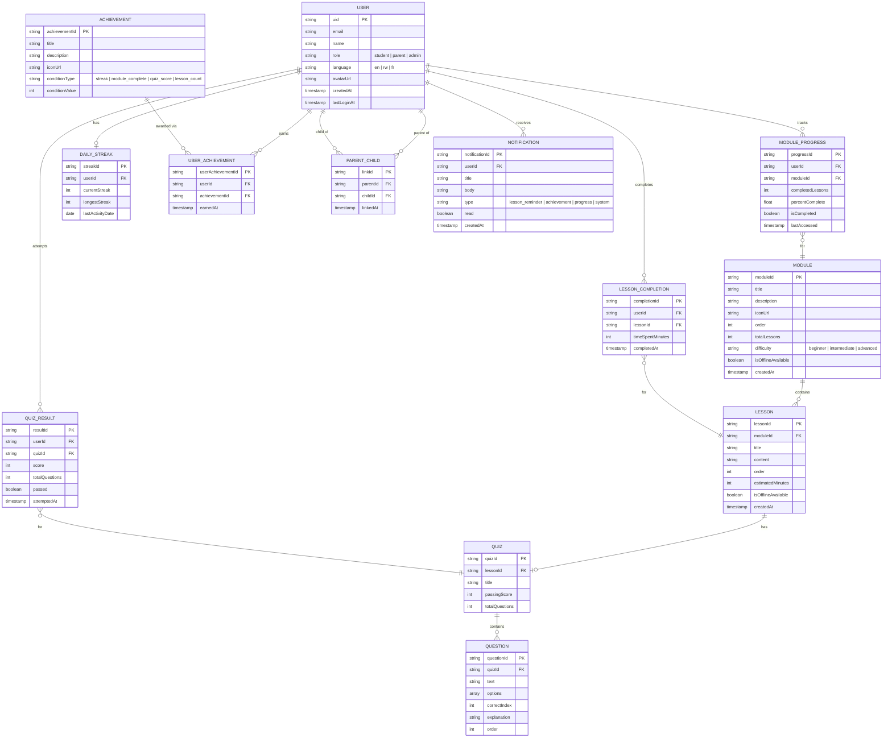

# Tumenye App — Entity Relationship Diagram

## Overview

The database is structured around **3 user roles**: Student, Parent, and Admin/Teacher.
All collections are designed for Firestore with offline-friendliness in mind.

---

## ERD (Mermaid)



---

## Entities & Descriptions

### USER
Central entity for all three roles. `role` field determines access level and which dashboard is shown.

| Field | Type | Notes |
|---|---|---|
| uid | string (PK) | Firebase Auth UID |
| email | string | Unique, from Firebase Auth |
| name | string | Display name |
| role | enum | `student`, `parent`, `admin` |
| language | enum | `en`, `rw` (Kinyarwanda), `fr` |
| avatarUrl | string | Profile picture URL |
| createdAt | timestamp | Account creation date |
| lastLoginAt | timestamp | Last login date |

---

### MODULE
A top-level learning topic (e.g. "Microsoft Word", "Spreadsheets", "Email", "Internet Safety").

| Field | Type | Notes |
|---|---|---|
| moduleId | string (PK) | Auto-generated |
| title | string | e.g. "Using Word" |
| description | string | Short summary |
| iconUrl | string | Module icon |
| order | int | Display sequence |
| totalLessons | int | Denormalized count |
| difficulty | enum | `beginner`, `intermediate`, `advanced` |
| isOfflineAvailable | boolean | Whether content can be downloaded |

---

### LESSON
An individual lesson inside a module.

| Field | Type | Notes |
|---|---|---|
| lessonId | string (PK) | Auto-generated |
| moduleId | string (FK) | Parent module |
| title | string | Lesson title |
| content | string | Markdown/rich text |
| order | int | Sequence within module |
| estimatedMinutes | int | Target <10 min per user research |
| isOfflineAvailable | boolean | Can be cached locally |

---

### QUIZ
One quiz per lesson (optional). Contains multiple questions.

| Field | Type | Notes |
|---|---|---|
| quizId | string (PK) | |
| lessonId | string (FK) | One quiz per lesson |
| title | string | Quiz title |
| passingScore | int | Minimum score to pass (e.g. 70) |
| totalQuestions | int | Denormalized count |

---

### QUESTION
Individual question inside a quiz.

| Field | Type | Notes |
|---|---|---|
| questionId | string (PK) | |
| quizId | string (FK) | Parent quiz |
| text | string | Question text |
| options | array | List of answer strings |
| correctIndex | int | Index of correct option |
| explanation | string | Shown after answering |
| order | int | Display sequence |

---

### MODULE_PROGRESS
Tracks a student's overall progress within a module.

| Field | Type | Notes |
|---|---|---|
| progressId | string (PK) | `{userId}_{moduleId}` |
| userId | string (FK) | Student |
| moduleId | string (FK) | Module |
| completedLessons | int | Count of finished lessons |
| percentComplete | float | 0.0 – 1.0 |
| isCompleted | boolean | All lessons done |
| lastAccessed | timestamp | For "continue learning" feature |

---

### LESSON_COMPLETION
Records when a student completes a specific lesson.

| Field | Type | Notes |
|---|---|---|
| completionId | string (PK) | `{userId}_{lessonId}` |
| userId | string (FK) | Student |
| lessonId | string (FK) | Lesson |
| timeSpentMinutes | int | Session time |
| completedAt | timestamp | |

---

### QUIZ_RESULT
Stores each quiz attempt by a student.

| Field | Type | Notes |
|---|---|---|
| resultId | string (PK) | |
| userId | string (FK) | Student |
| quizId | string (FK) | Quiz |
| score | int | Number of correct answers |
| totalQuestions | int | Snapshot at time of attempt |
| passed | boolean | score >= passingScore |
| attemptedAt | timestamp | |

---

### DAILY_STREAK
One record per user tracking their learning consistency.

| Field | Type | Notes |
|---|---|---|
| streakId | string (PK) | Same as userId |
| userId | string (FK) | Student |
| currentStreak | int | Consecutive days active |
| longestStreak | int | All-time best |
| lastActivityDate | date | Used to calculate streak |

---

### ACHIEVEMENT
Defines badge/achievement types. Created by admins.

| Field | Type | Notes |
|---|---|---|
| achievementId | string (PK) | |
| title | string | e.g. "Early Bird" |
| description | string | How to earn it |
| iconUrl | string | Badge icon |
| conditionType | enum | `streak`, `module_complete`, `quiz_score`, `lesson_count` |
| conditionValue | int | Threshold to unlock |

---

### USER_ACHIEVEMENT
Junction table — achievements earned by a user.

| Field | Type | Notes |
|---|---|---|
| userAchievementId | string (PK) | `{userId}_{achievementId}` |
| userId | string (FK) | |
| achievementId | string (FK) | |
| earnedAt | timestamp | |

---

### PARENT_CHILD
Links a parent user to their student child(ren).

| Field | Type | Notes |
|---|---|---|
| linkId | string (PK) | `{parentId}_{childId}` |
| parentId | string (FK) | User with role=parent |
| childId | string (FK) | User with role=student |
| linkedAt | timestamp | |

---

### NOTIFICATION
User-specific notification records.

| Field | Type | Notes |
|---|---|---|
| notificationId | string (PK) | |
| userId | string (FK) | Recipient |
| title | string | |
| body | string | |
| type | enum | `lesson_reminder`, `achievement`, `progress`, `system` |
| read | boolean | |
| createdAt | timestamp | |

---

## Firestore Collection Structure

```
/users/{uid}
/modules/{moduleId}
/lessons/{lessonId}
/quizzes/{quizId}
/questions/{questionId}
/achievements/{achievementId}

/progress/{userId}/modules/{moduleId}
/progress/{userId}/lessons/{lessonId}
/progress/{userId}/quizzes/{resultId}
/progress/{userId}/streak

/userAchievements/{userId}/badges/{achievementId}
/parentLinks/{parentId}/children/{childId}
/notifications/{userId}/items/{notificationId}
```

---

## Key Design Decisions

1. **Denormalized counts** (`totalLessons`, `totalQuestions`) — avoids expensive collection-count queries on low-data connections.
2. **Composite primary keys** (e.g. `{userId}_{moduleId}`) — enables direct document lookups without queries, faster and cheaper.
3. **Subcollections for user data** (`/progress`, `/notifications`) — keeps user data isolated and enables per-user security rules.
4. **`isOfflineAvailable` flag** on Module and Lesson — supports the core offline download requirement from user research.
5. **`role` on User** — single source of truth for access control in security rules.
