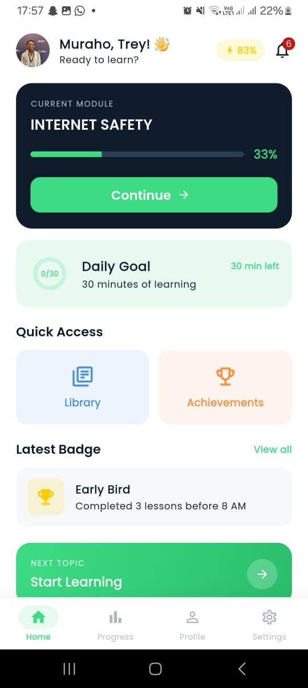
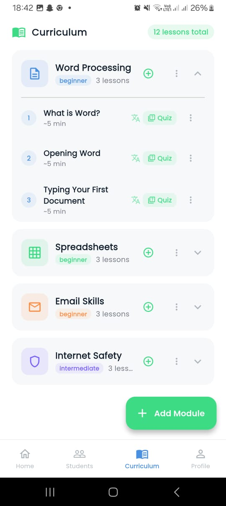
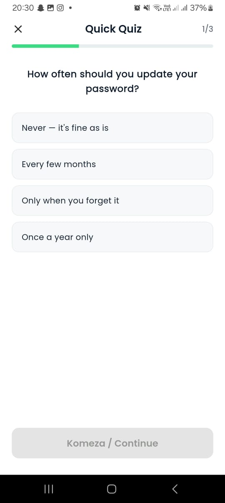
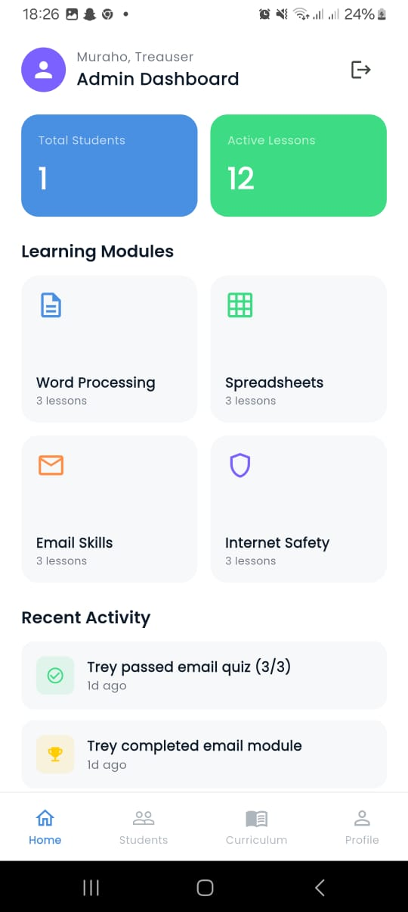
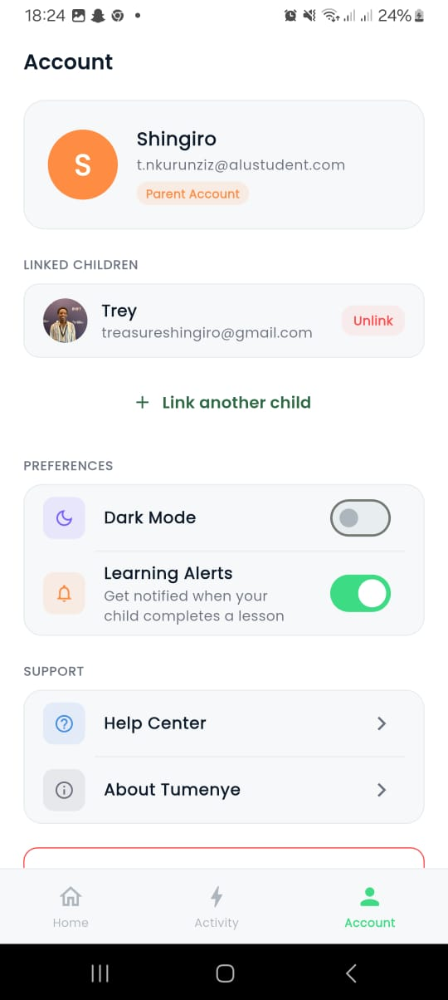
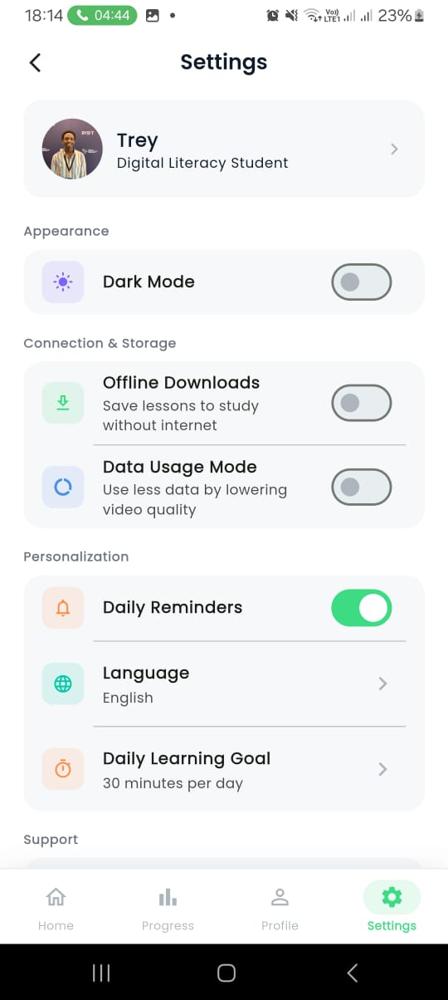
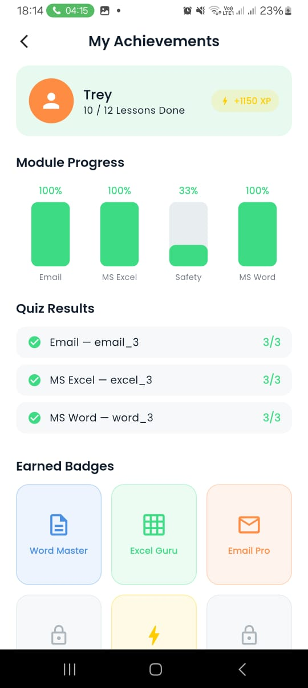
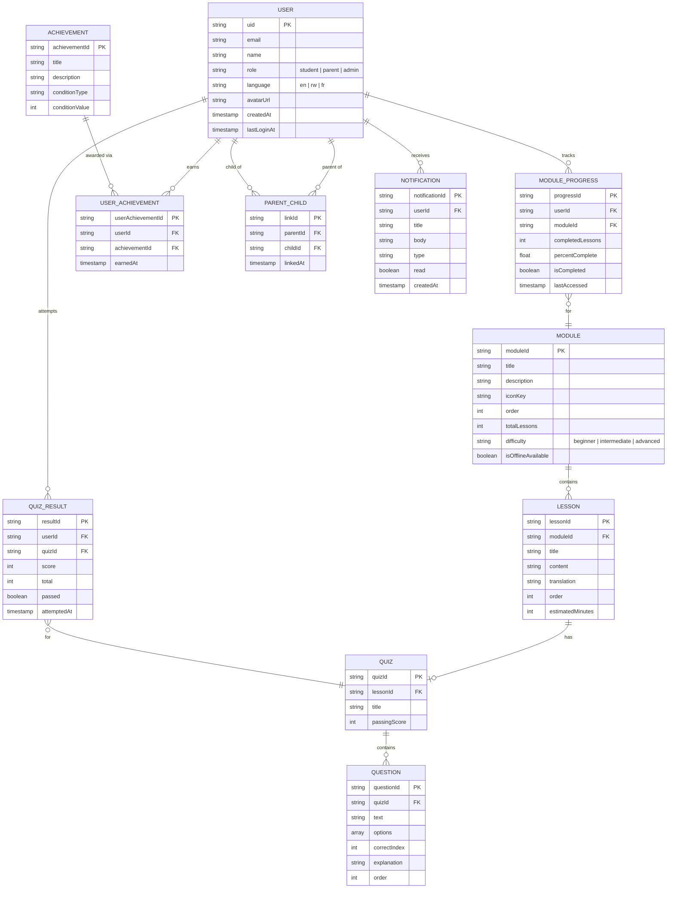
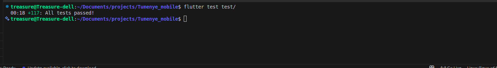

# Tumenye — Digital Literacy App for Rwandan Students

Tumenye is a cross-platform mobile application built with Flutter and Firebase. It is designed to help Rwandan students aged 8–18 build practical digital skills through structured, interactive lessons covering Word Processing, Spreadsheets, Email Communication, and Online Safety. The app runs on Android and iOS from a single codebase and supports English, Kinyarwanda, and French.

> **Group 9 — ALU Mobile Application Development**

---

## Screenshots

| Welcome | Student Home | Modules | Quiz |
|---------|-------------|---------|------|
|  |  |  |  |

| Admin Dashboard | Parent Dashboard | Settings | Achievements |
|----------------|-----------------|---------|--------------|
|  |  |  |  |

---

## Features

**Students** can work through four sequential learning modules — Word, Excel, Email, and Online Safety — with lessons available in English, Kinyarwanda, and French. Each lesson ends with a multiple-choice quiz; a score of 70% or above is required to progress. Completed lessons and quiz scores are tracked, and badges are awarded for milestones such as finishing a module or achieving a perfect score. A daily learning goal tracker shows progress against a user-defined time target.

**Parents** can link their account to a child's account using the child's email address. The parent dashboard shows recently completed lessons, quiz results, and a log of learning activity over time.

**Administrators** have full control over the curriculum. They can create, edit, and delete modules, lessons, and quiz questions directly within the app. The admin dashboard also shows a list of all registered students, a real-time activity feed, and key statistics such as total students and active lessons.

---

## Tech Stack

| Layer | Technology |
|-------|------------|
| Framework | [Flutter](https://flutter.dev) — Dart, stable channel, version 3.19 or higher |
| State Management | [Riverpod](https://riverpod.dev) 2.5 |
| Navigation | [GoRouter](https://pub.dev/packages/go_router) 13 |
| Backend | [Firebase](https://firebase.google.com) — Authentication, Firestore, Storage |
| Image Hosting | [Cloudinary](https://cloudinary.com) — avatar uploads |
| Localization | [easy_localization](https://pub.dev/packages/easy_localization) |

---

## Database Architecture (ERD)

The database is structured around **3 user roles**: Student, Parent, and Admin/Teacher. All collections are designed for Firestore.



### Firestore Collection Structure

```
/users/{uid}
/modules/{moduleId}
/lessons/{lessonId}
/quizzes/{quizId}
/progress/{userId}/modules/{moduleId}
/progress/{userId}/lessons/{lessonId}
/quizResults/{userId}/{resultId}
/userAchievements/{userId}/badges/{achievementId}
/parentLinks/{parentId}/children/{childId}
/activity/{activityId}
/screenTime/{userId}/{date}
/notifications/{userId}/items/{notificationId}
```

### Key Design Decisions

1. **Denormalized counts** (`totalLessons`) — avoids expensive collection-count queries on low-data connections.
2. **Composite primary keys** (e.g. `{userId}_{moduleId}`) — enables direct document lookups without queries.
3. **Subcollections for user data** (`/progress`, `/notifications`) — keeps user data isolated and enables per-user security rules.
4. **`role` on User** — single source of truth for access control in security rules and GoRouter redirects.

---

## Project Structure

```
lib/
├── main.dart                  # Application entry point
├── core/
│   ├── constants/             # App-wide constants and shared preference keys
│   ├── models/                # Data models: User, Module, Lesson, Quiz, Progress
│   ├── providers/             # Riverpod providers (auth, Firestore streams, preferences)
│   ├── services/              # Firebase service wrappers: Auth, Firestore, ImageUpload
│   ├── router/                # GoRouter setup and role-based redirect logic
│   └── theme/                 # Light and dark Material 3 theme definitions
├── features/
│   ├── auth/                  # Login, registration, email verification, password reset
│   ├── home/                  # Student home dashboard
│   ├── modules/               # Module list and lesson viewer
│   ├── lesson/                # Lesson content screen
│   ├── quiz/                  # Quiz screen and results display
│   ├── achievements/          # Badge system
│   ├── notifications/         # Notification centre
│   ├── profile/               # User profile and avatar
│   ├── parent/                # Parent dashboard and activity feed
│   ├── admin/                 # Admin dashboard, curriculum management, student list
│   └── settings/              # Theme toggle, language selection, daily goal
└── shared/
    └── widgets/               # Reusable UI components: AppTextField, UserAvatar, etc.
```

---

## Setup and Installation

### Prerequisites

- [Flutter SDK](https://docs.flutter.dev/get-started/install) — stable channel, version 3.19 or higher
- Dart SDK (bundled with Flutter)
- Android Studio or Xcode
- Git
- [Firebase CLI](https://firebase.google.com/docs/cli)
- [FlutterFire CLI](https://firebase.flutter.dev/docs/cli)

### Step 1 — Clone the repository

```bash
git clone https://github.com/hasby-umutoniwabo/Tumenye_mobile.git
cd Tumenye_mobile
```

### Step 2 — Install dependencies

```bash
flutter pub get
```

### Step 3 — Configure Firebase

**For team members joining the existing project:**

Ask a project owner to add you under Firebase Console → Project Settings → Members and roles. Once you have access:

1. Go to [Firebase Console](https://console.firebase.google.com) and open the Tumenye project
2. Navigate to Project Settings → Your apps
3. Download `google-services.json` and place it in `android/app/`
4. Download `GoogleService-Info.plist` and place it in `ios/Runner/`
5. Run the FlutterFire CLI to generate `lib/firebase_options.dart`:

```bash
flutterfire configure
```

**For independent deployments:**

1. Create a new project at [console.firebase.google.com](https://console.firebase.google.com)
2. Enable Email/Password and Google Sign-In under Authentication → Sign-in Method
3. Create a Cloud Firestore database in production mode
4. Enable Firebase Storage
5. Download the config files and place them as described above
6. Run `flutterfire configure` to generate `firebase_options.dart`

### Step 4 — Add Cloudinary credentials

Profile image uploads use Cloudinary. Create the file `lib/core/constants/secrets.dart`:

```dart
class Secrets {
  static const String cloudName = 'YOUR_CLOUD_NAME';
  static const String cloudinaryApiKey = 'YOUR_API_KEY';
  static const String cloudinaryApiSecret = 'YOUR_API_SECRET';
}
```

A template is available at `lib/core/constants/secrets.example.dart`. This file is listed in `.gitignore` and must not be committed.

### Step 5 — Run the application

```bash
flutter run
```

To build a release APK:

```bash
flutter build apk --release
```

---

## Testing

### Running automated tests

```bash
flutter test test/
```

All **117 tests pass** across 6 test files.

### Test coverage

```bash
flutter test test/ --coverage
```

Coverage on testable files (models, auth screens, shared widgets): **71.4%**




### Test files

| File | Tests | What it covers |
|------|-------|----------------|
| `test/unit_test.dart` | 8 | AppStrings, PrefKeys, ModuleData constants |
| `test/model_test.dart` | ~45 | All 7 models — constructors, `toMap`, `copyWith`, getters |
| `test/models_firestore_test.dart` | 20 | `fromFirestore` factory methods using `fake_cloud_firestore` |
| `test/auth_service_test.dart` | 11 | `AuthService.friendlyError()` — all Firebase error codes |
| `test/register_screen_test.dart` | 11 | RegisterScreen UI and form validation |
| `test/widget_test.dart` | 22 | WelcomeScreen, LoginScreen, RegisterScreen, ForgotPasswordScreen |

### Manual testing

| Test Case | Result |
|-----------|--------|
| User registration with valid email | PASS |
| Registration with an email already in use | PASS |
| Google Sign-In routes to correct dashboard | PASS |
| Login with incorrect password shows error | PASS |
| Unverified users blocked from home screen | PASS |
| Completing a lesson updates progress in Firestore | PASS |
| Correct quiz answer highlighted green | PASS |
| Incorrect quiz answer highlighted red | PASS |
| Quiz result saved to Firestore with timestamp | PASS |
| Admin-added module appears on student screen immediately | PASS |
| Switching language to Kinyarwanda updates all UI text | PASS |
| Dark mode toggle persists after app restart | PASS |
| Admin user cannot access student routes | PASS |
| Parent dashboard correctly displays child activity | PASS |

---

## User Preferences

The following preferences are saved via `shared_preferences` and restored on app relaunch, scoped per user (by Firebase UID):

| Preference | Key | Default |
|------------|-----|---------|
| Theme mode (light/dark) | `pref_theme_mode_{uid}` | Light |
| Language | `pref_language_{uid}` | English |
| Daily learning goal (minutes) | `pref_daily_goal_minutes_{uid}` | 20 |
| Offline mode | `pref_offline_mode` | Off |
| Daily reminders | `pref_daily_reminders` | Off |
| Reduce data usage | `pref_data_usage_mode` | Off |

---

## Security

Firestore security rules enforce role-based access:

- **Students** can only read/write their own progress, quiz results, and profile
- **Parents** can read their linked child's progress and screen time
- **Admins** can read/write all curriculum content (modules, lessons, quizzes)
- All write operations require authentication; unauthenticated reads are blocked

Role-based routing in GoRouter ensures students, parents, and admins cannot navigate to each other's screens. The following files contain sensitive credentials and are excluded via `.gitignore`:

- `lib/firebase_options.dart`
- `lib/core/constants/secrets.dart`
- `android/app/google-services.json`
- `ios/Runner/GoogleService-Info.plist`

---

## Data Seeding

On first launch, the app checks whether Firestore contains any curriculum data. If the database is empty, it automatically seeds the initial modules, lessons, and quiz questions so the app is usable immediately without manual data entry.

---

## Localization

The app supports three languages selectable from the Settings screen: **English**, **Kinyarwanda**, and **French**. Language preference is stored per user via `shared_preferences` and applied on next launch.

---
